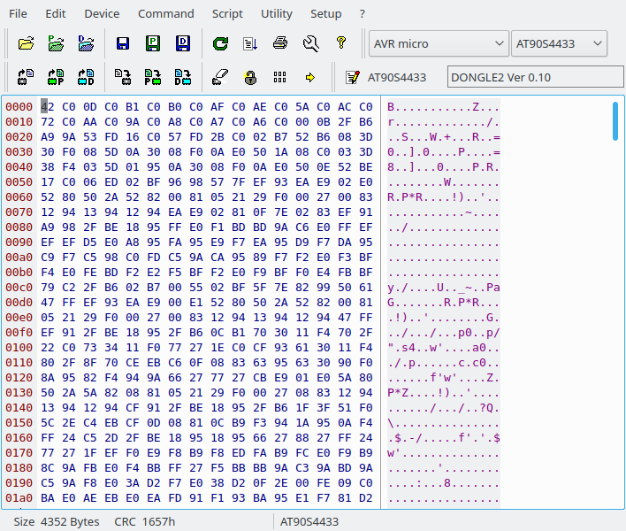

#3.0.2 - PonyProg - Serial Device Programmer
PonyProg is a serial device programmer software with a user friendly GUI framework available for Windows and Linux. It's purpose is reading and writing every serial device. With PonyProg and SI-Prog you can program Wafercard for SAT, eeprom within GSM, TV or CAR-RADIO. Furthermore it can be used as a low cost starter kit for PIC and AVR.
Ponyprog supports AVR, SPI eeprom, AVR micro, 12C bus 8bit eeprom, PIC 16 micro, PIC 12 micro, AT89S micro and SDE2506 eeprom family chips.
You can open any HEX, e2p, mot, csm, rom, eep, bin files and burn them to uC or PIC. You can even backup the old program on the chip using Ponyprog. Ponyprog enables the user to write, verify and erase data on the microchip.
Also setting fuse bits and locks using Ponyprog is possible. You can save any HEX file to BIN file or eep file, BIN file to HEX file or MOT file and vice versa so you can use Ponyprog as converter too. Ponyprog offers serial or parallel port programming for uC's. You can even change polarity of control lines without touching the wires using I/O port setup. 

You can find it at [www.LancOS.com](http://www.LancOS.com) 

